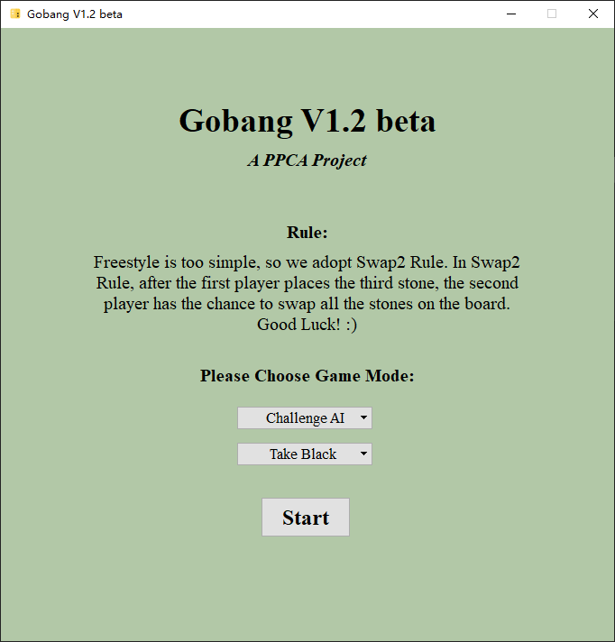

## Gobang AI

- Ａ project for **MS125:Principle and Practice of Computer Algorithms (Summer 2020)**

[View the PPCA Repo](https://github.com/Gabr1e1/Gomoku)

|  Algorithms  | State  |
|  ----  | ----  |
| Minimax search  | Available |
| Alpha-beta pruning | Available |
| Iterative DFS | Available |
| Monte Carlo Tree Search(MCTS) | Not Yet |
| Reinforcement Learning | Not Yet |

### V1.0
- Beat the baseline.

### V1.1
- Fix some issues which may cause TLE.

### About GUI
- GUI has been implemented through Qt.

